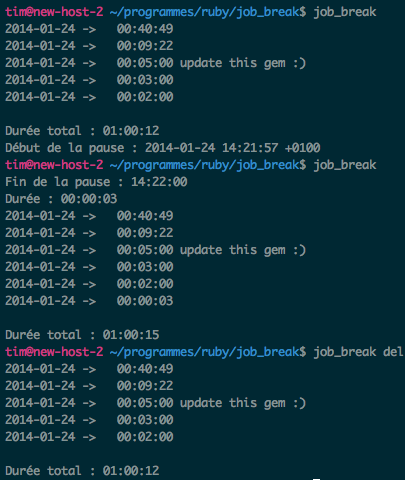

How to use this script :

You need :
* ruby >= 1.9
* gem bundler

##To build it:
```shell
gem build job_break.gemspec
```

##To install it:
```shell
gem install ./job_break-0.0.6.gem
job_break setup
```
don't forget to type ```job_break setup``` the first time you use it. It creates database

##To use it:
```shell
#to run the timer
$> job_break
#to stop the timer
$> job_break

#To display today
$> job_break show

#To display previous day
$> job_break show -1

#To add 34 min of break with a comment. Comments are optional
$> job_break add 34 "lunch"

#To delete the last entry
$> job_break del
```

for more help
```shell
job_break -h
```

##To test in irb
```shell
irb -Ilib -rjob_break #'lib' is the first folder, 'job_break' is 'job_break.rb' inside 'lib'
```
then
```ìrb
JobBreak::Main.new.start(["show"])
```

##demo
Here I start a pause
Then I stop it (it last only 3 seconds)
Then I delete the last one



#LICENSE

MIT
